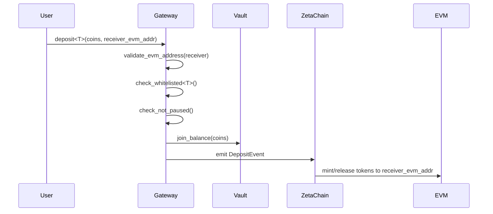
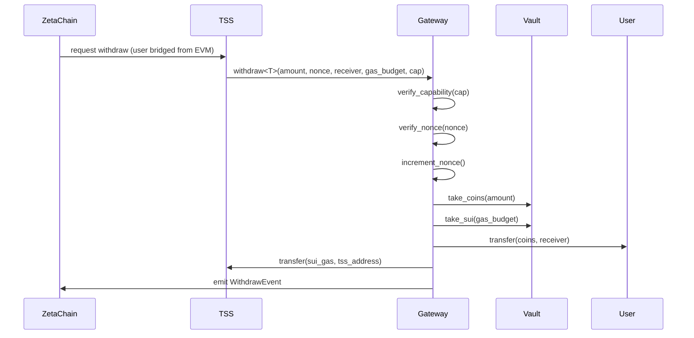
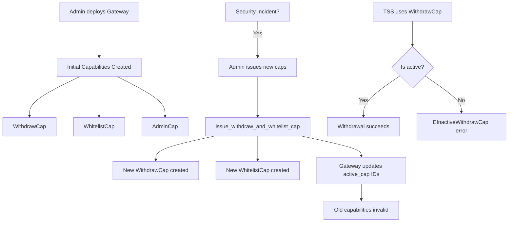

# ZetaChain x Sui Gateway - Security Architecture Analysis

**Date**: 2025-11-10  
**Analyzed Version**: Branch `cursor/blockchain-security-audit-and-vulnerability-research-2873`  
**Auditor**: Security Analysis Team

---

## 1. Executive Summary

The ZetaChain x Sui Gateway is a cross-chain bridge smart contract deployed on the Sui blockchain that enables interoperability between Sui and EVM-compatible chains through ZetaChain's cross-chain infrastructure. The contract manages token deposits from Sui users and withdrawals controlled by a Threshold Signature Scheme (TSS) system, creating a bi-directional bridge for asset transfers.

**Key Components:**
- **Gateway Module**: Core bridge logic with deposit/withdraw functionality
- **EVM Module**: Address validation utilities for EVM compatibility
- **Capability-Based Access Control**: Three-tier permission system (Admin, Withdraw, Whitelist)
- **Nonce-Based Replay Protection**: Sequential transaction ordering to prevent replay attacks
- **Message Context System**: Authenticated cross-chain call mechanism

---

## 2. System Architecture

### 2.1 High-Level Overview

The gateway operates as a shared object on Sui that:
1. Accepts deposits of whitelisted tokens from Sui users with EVM receiver addresses
2. Stores deposited tokens in per-coin-type vaults
3. Allows authorized TSS to withdraw tokens to Sui addresses with gas reimbursement
4. Emits events that off-chain observers (ZetaChain) monitor to trigger cross-chain actions
5. Supports authenticated cross-chain contract calls via MessageContext

```
┌─────────────────────────────────────────────────────────────────┐
│                         Sui Blockchain                          │
│                                                                 │
│  ┌────────────┐         ┌──────────────────┐                  │
│  │  Sui User  │────────>│  Gateway (Shared)│                  │
│  └────────────┘         │                  │                  │
│       deposit           │  ┌──────────────┐│                  │
│                         │  │ Vault<SUI>   ││                  │
│                         │  ├──────────────┤│                  │
│  ┌────────────┐         │  │ Vault<USDC>  ││                  │
│  │    TSS     │<────────│  ├──────────────┤│                  │
│  └────────────┘         │  │ Vault<Token> ││                  │
│    withdraw +           │  └──────────────┘│                  │
│    gas refund           │                  │                  │
│                         │  Nonce: u64      │                  │
│  ┌────────────┐         │  Capabilities    │                  │
│  │   Admin    │────────>│  Paused: bool    │                  │
│  └────────────┘         └──────────────────┘                  │
│    management                     │                            │
│                                   │ Events                     │
│                                   ▼                            │
└───────────────────────────────────┼────────────────────────────┘
                                    │
                                    │
                          ┌─────────┴──────────┐
                          │   ZetaChain Core   │
                          │   (Off-chain)      │
                          └─────────┬──────────┘
                                    │
                          ┌─────────┴──────────┐
                          │   EVM Chains       │
                          │   (Destination)    │
                          └────────────────────┘
```

### 2.2 Data Flow Diagrams

#### 2.2.1 Deposit Flow



#### 2.2.2 Withdraw Flow



#### 2.2.3 Capability Management Flow



### 2.3 Core Data Structures

#### Gateway (Shared Object)
```move
public struct Gateway has key {
    id: UID,
    vaults: Bag,                    // Per-coin-type token storage
    nonce: u64,                     // Replay protection counter
    active_withdraw_cap: ID,        // Currently valid WithdrawCap
    active_whitelist_cap: ID,       // Currently valid WhitelistCap
    deposit_paused: bool,           // Emergency pause flag
}
```

#### Vault (Per-Token Storage)
```move
public struct Vault<phantom T> has store {
    balance: Balance<T>,            // Token balance
    whitelisted: bool,              // Whether deposits/withdrawals allowed
}
```

#### Capabilities (Access Control)
```move
public struct WithdrawCap has key, store {
    id: UID,  // TSS holds this to withdraw funds
}

public struct WhitelistCap has key, store {
    id: UID,  // Operator holds this to add new tokens
}

public struct AdminCap has key, store {
    id: UID,  // Admin holds this for emergency functions
}

public struct MessageContext has key, store {
    id: UID,
    sender: String,     // EVM address of cross-chain sender
    target: address,    // Sui package being called
}
```

---

## 3. Trust Model & Security Assumptions

### 3.1 Trust Boundaries

**Trusted Entities:**
1. **Admin (AdminCap holder)**
   - Can pause/unpause deposits
   - Can reset nonce (emergency recovery)
   - Can issue new capabilities (key rotation)
   - Can whitelist/unwhitelist tokens
   - **Trust Level**: HIGH - Compromise means total system control

2. **TSS (WithdrawCap holder)**
   - Can withdraw any whitelisted token
   - Can drain SUI vault via gas_budget parameter
   - Must provide correct nonce to prevent replay
   - **Trust Level**: HIGH - Compromise means fund theft

3. **Whitelist Operator (WhitelistCap holder)**
   - Can add new token types
   - Cannot withdraw funds
   - **Trust Level**: MEDIUM - Can enable malicious token deposits

**Untrusted Entities:**
1. **Regular Users**
   - Can only deposit whitelisted tokens
   - Cannot withdraw
   - Cannot modify gateway state beyond deposits

### 3.2 Security Assumptions

#### Cryptographic Assumptions
- Sui's object-capability model prevents unauthorized access to capability objects
- UID uniqueness prevents object ID collisions
- Type system prevents type confusion attacks

#### Operational Assumptions
1. **TSS is Byzantine Fault Tolerant**: The TSS implementation correctly implements threshold signatures and won't produce unauthorized signatures
2. **Off-chain Observer (ZetaChain) is Reliable**: Events are correctly monitored and processed
3. **Nonce Management is Correct**: TSS maintains nonce synchronization with on-chain state
4. **Admin Key Security**: AdminCap private key is stored securely (HSM, multi-sig, etc.)
5. **No Front-running on Sui**: Sui's transaction ordering prevents front-running attacks on nonce-based operations

#### Economic Assumptions
1. Gas fees on Sui remain economically reasonable for bridge operations
2. Deposited funds in vaults exceed gas budget withdrawals (SUI vault solvency)
3. Bridge economic security > value of assets held in gateway

---

## 4. Attack Surface Analysis

### 4.1 External Entry Points

#### Public Entry Functions (Anyone can call)
1. **`deposit<T>`** - Deposit tokens to bridge
   - Input: `Coin<T>`, EVM address string
   - Validation: EVM address format, token whitelisted, not paused
   - State Changes: Increases vault balance, emits event

2. **`deposit_and_call<T>`** - Deposit with cross-chain call payload
   - Input: `Coin<T>`, EVM address, payload bytes (max 1024)
   - Additional Validation: Payload length check
   - Risk: Payload interpretation happens off-chain

3. **`donate<T>`** - Donation to vault without bridging
   - Input: `Coin<T>`
   - Uses hardcoded zero address as receiver
   - Purpose: Replenish vault balances

#### Privileged Entry Functions

**WithdrawCap Required:**
4. **`withdraw<T>`** - TSS withdraws tokens
   - Input: amount, nonce, receiver, gas_budget, cap
   - Critical: Nonce must match, cap must be active
   - Side Effect: Drains both token vault AND SUI vault (gas)

5. **`increase_nonce`** - Skip transaction (failed outbound)
   - Input: nonce, gas_budget, cap
   - Critical: Only increments nonce, still withdraws SUI for gas

**WhitelistCap Required:**
6. **`whitelist<T>`** - Add new token type
   - Creates vault if doesn't exist or enables existing vault

**AdminCap Required:**
7. **`unwhitelist<T>`** - Disable token (doesn't prevent withdrawal!)
8. **`pause/unpause`** - Emergency deposit freeze
9. **`reset_nonce`** - Manually set nonce (dangerous!)
10. **`issue_withdraw_and_whitelist_cap`** - Key rotation
11. **`issue_message_context`** - Create authenticated call context
12. **`set_message_context`** - Set sender/target for authenticated call
13. **`reset_message_context`** - Clear message context after call

### 4.2 Attack Vectors by Category

#### 4.2.1 Replay Attack Vectors
- ✅ **Mitigated**: Nonce-based ordering prevents transaction replay
- ⚠️ **Risk**: `reset_nonce` function allows admin to rewind nonce, potentially enabling replay

#### 4.2.2 Authorization Bypass Vectors
- ✅ **Mitigated**: Capability-based access control with active ID verification
- ⚠️ **Risk**: Old capability objects remain in existence after revocation (memory leak)

#### 4.2.3 Economic Attack Vectors
- 🔴 **High Risk**: Gas budget parameter in withdraw functions allows arbitrary SUI vault drainage
- 🔴 **High Risk**: No limit on gas_budget value per transaction
- 🟡 **Medium Risk**: Vault imbalance if SUI vault depleted (legitimate withdrawals fail)

#### 4.2.4 Cross-Chain Attack Vectors
- 🟡 **Medium Risk**: EVM address validation is format-only (no checksum verification)
- 🟡 **Medium Risk**: Payload in `deposit_and_call` not validated on-chain
- 🟡 **Medium Risk**: MessageContext can be set without validating it matches active ID

#### 4.2.5 Denial of Service Vectors
- 🟡 **Medium Risk**: Admin can pause deposits indefinitely
- 🟢 **Low Risk**: No loops over unbounded collections (DOS via gas exhaustion unlikely)

---

## 5. Threat Model

### 5.1 Threat Actor Profiles

#### Threat Actor 1: Malicious External User
**Motivation**: Steal funds or cause financial damage  
**Capabilities**: Can send transactions to public entry points  
**Limitations**: No capability objects, must pass validation checks

**Attack Scenarios:**
1. ❌ Attempt to withdraw without capability → Blocked by capability check
2. ❌ Deposit unwhitelisted token → Blocked by whitelist check
3. ❌ Deposit with invalid EVM address → Blocked by EVM address validation
4. ✅ Deposit then immediately attempt to front-run TSS withdrawal → **Unlikely on Sui**
5. ⚠️ Send malicious payload in deposit_and_call → **Payload processed off-chain**

#### Threat Actor 2: Compromised TSS (WithdrawCap holder)
**Motivation**: Maximize fund theft before detection  
**Capabilities**: Valid WithdrawCap, can call withdraw functions  
**Limitations**: Must use sequential nonces, admin can revoke capability

**Attack Scenarios:**
1. ✅ Withdraw maximum balance from all vaults → **CRITICAL IMPACT**
2. ✅ Set gas_budget to max available SUI → **Drains SUI vault**
3. ✅ Perform withdrawals with amount=0 but high gas_budget → **Pure SUI theft**
4. ⚠️ Try to use old nonces → Blocked by nonce check
5. ✅ Withdraw to attacker-controlled address → **Funds lost**

**Mitigation**: Admin must quickly detect and issue new capabilities

#### Threat Actor 3: Compromised Admin (AdminCap holder)
**Motivation**: Total system compromise  
**Capabilities**: All administrative functions  
**Limitations**: Cannot directly withdraw (needs WithdrawCap)

**Attack Scenarios:**
1. ✅ Reset nonce to enable replay attacks → **CRITICAL**
2. ✅ Issue new WithdrawCap to attacker → **CRITICAL**
3. ✅ Whitelist malicious token contract → **Token-specific attack**
4. ✅ Pause deposits to cause DOS → **Availability impact**
5. ✅ Set malicious MessageContext → **Cross-chain call manipulation**

**Mitigation**: AdminCap should be multi-sig or time-locked

#### Threat Actor 4: Malicious Whitelist Operator
**Motivation**: Enable exploits through malicious tokens  
**Capabilities**: WhitelistCap holder  
**Limitations**: Cannot withdraw or access admin functions

**Attack Scenarios:**
1. ⚠️ Whitelist token with malicious `Coin` implementation → **Depends on Sui type safety**
2. ✅ Whitelist many tokens to bloat storage → **DOS via state growth**
3. ❌ Direct fund theft → Not possible without WithdrawCap

### 5.2 Threat Prioritization Matrix

| Threat | Likelihood | Impact | Risk Score | Priority |
|--------|-----------|--------|------------|----------|
| TSS Compromise → Fund Theft | Low | Critical | HIGH | P0 |
| Gas Budget Abuse → SUI Drain | Medium | High | HIGH | P0 |
| Admin Nonce Reset → Replay | Low | Critical | HIGH | P1 |
| Malicious MessageContext | Low | High | MEDIUM | P2 |
| Deposit DOS via Pause | Low | Medium | MEDIUM | P2 |
| Malicious Token Whitelist | Low | Medium | MEDIUM | P3 |
| EVM Address Format Exploit | Very Low | Low | LOW | P3 |

---

## 6. Security Controls Assessment

### 6.1 Existing Controls

#### ✅ Strong Controls
1. **Capability-Based Access Control**
   - Prevents unauthorized withdrawals
   - Active ID verification prevents old capability use
   - Separation of duties (Admin/Withdraw/Whitelist)

2. **Nonce-Based Replay Protection**
   - Sequential ordering prevents transaction replay
   - Each withdrawal increments nonce atomically

3. **Whitelist Mechanism**
   - Prevents unauthorized token types from being deposited
   - Admin control over supported assets

4. **Emergency Pause**
   - Admin can halt deposits during incidents
   - Withdrawals remain possible (for recovery)

5. **EVM Address Validation**
   - Format validation prevents obviously invalid addresses
   - Prevents silent failure on destination chain

#### ⚠️ Moderate Controls
1. **Gas Budget Mechanism**
   - ✅ Ensures TSS can be reimbursed for gas
   - ❌ No upper bound or rate limiting
   - ❌ Can be abused to drain SUI vault

2. **Message Context System**
   - ✅ Enables authenticated cross-chain calls
   - ❌ No verification that MessageContext is active
   - ❌ Set/reset functions don't validate proper usage

3. **Capability Revocation**
   - ✅ Admin can issue new capabilities
   - ❌ Old capabilities remain as objects (can't be destroyed)
   - ❌ No event emitted when capabilities are revoked

#### 🔴 Weak/Missing Controls
1. **No Gas Budget Limits**
   - Missing: Maximum gas_budget per transaction
   - Missing: Rate limiting on SUI vault withdrawals
   - Missing: SUI vault balance threshold checks

2. **No Withdraw Amount Validation**
   - Missing: Minimum withdrawal amount check
   - Allows: Zero-amount withdrawals (pure gas drain)

3. **No Timelock on Admin Actions**
   - Missing: Delay before critical admin functions take effect
   - Instant: Admin can pause or reset nonce immediately

4. **No Multi-Signature Requirement**
   - Missing: Multiple signatures for high-risk operations
   - Single: AdminCap and WithdrawCap are single objects

5. **No Withdrawal Limits**
   - Missing: Maximum withdrawal amount per transaction
   - Missing: Maximum withdrawal amount per time period

---

## 7. Security Recommendations

### 7.1 Critical Priority (P0)

1. **Implement Gas Budget Limits**
   ```move
   const MAX_GAS_BUDGET_PER_TX: u64 = 100_000_000; // 0.1 SUI
   
   public fun withdraw_impl<T>(..., gas_budget: u64, ...) {
       assert!(gas_budget <= MAX_GAS_BUDGET_PER_TX, EGasBudgetTooHigh);
       // ... rest of function
   }
   ```

2. **Add Minimum Withdrawal Amount Check**
   ```move
   const MIN_WITHDRAW_AMOUNT: u64 = 1;
   
   public fun withdraw_impl<T>(..., amount: u64, ...) {
       assert!(amount >= MIN_WITHDRAW_AMOUNT || amount == 0, EAmountTooLow);
       // Allow 0 only for increase_nonce
   }
   ```

3. **Implement SUI Vault Balance Guards**
   ```move
   const MIN_SUI_VAULT_BALANCE: u64 = 1_000_000_000; // 1 SUI reserve
   
   public fun withdraw_impl<T>(...) {
       // ... after SUI withdrawal
       let remaining = vault_balance<SUI>(gateway);
       assert!(remaining >= MIN_SUI_VAULT_BALANCE, ESuiVaultTooLow);
   }
   ```

### 7.2 High Priority (P1)

4. **Remove or Restrict `reset_nonce` Function**
   - **Option A**: Remove entirely (safer)
   - **Option B**: Add timelock and multi-sig requirement
   - **Option C**: Only allow incrementing, never decrementing

5. **Add MessageContext Active Validation**
   ```move
   entry fun set_message_context(
       gateway: &Gateway,  // Add parameter
       message_context: &mut MessageContext,
       sender: String,
       target: address
   ) {
       assert!(
           object::id(message_context) == active_message_context(gateway),
           EInactiveMessageContext
       );
       // ... rest of function
   }
   ```

6. **Emit Events for Capability Changes**
   ```move
   public struct CapabilityRevokedEvent has copy, drop {
       old_withdraw_cap: ID,
       old_whitelist_cap: ID,
       new_withdraw_cap: ID,
       new_whitelist_cap: ID,
   }
   ```

### 7.3 Medium Priority (P2)

7. **Implement Rate Limiting**
   ```move
   // Add to Gateway struct:
   last_withdraw_timestamp: u64,
   withdraw_count_current_period: u64,
   
   // Add constant:
   const MAX_WITHDRAWALS_PER_HOUR: u64 = 10;
   ```

8. **Add Withdrawal Amount Limits**
   ```move
   const MAX_WITHDRAW_PER_TX: u64 = 1_000_000_000_000; // Type-specific limits better
   ```

9. **Implement EIP-55 Checksum Validation**
   - Enhance `is_valid_evm_address` to validate checksummed addresses
   - Reduces risk of typos in destination addresses

### 7.4 Long-Term Improvements (P3)

10. **Implement Multi-Sig AdminCap**
    - Use Sui's multi-sig primitives or implement M-of-N scheme
    - Require multiple signatures for critical operations

11. **Add Timelock for Critical Admin Functions**
    - Pause/unpause: 24-hour timelock
    - Capability issuance: 48-hour timelock
    - Nonce reset: 7-day timelock + community review

12. **Implement Circuit Breaker**
    ```move
    // Automatically pause if anomalous activity detected:
    // - Withdrawal volume > threshold
    // - Unusual gas budget patterns
    // - Rapid sequential withdrawals
    ```

---

## 8. Compliance & Best Practices

### 8.1 Move Language Security Best Practices

✅ **Followed:**
- Capability-based access control
- Explicit error codes for debugging
- Type safety via phantom type parameters
- Shared object pattern for gateway
- Proper event emissions

⚠️ **Partially Followed:**
- Input validation (missing for gas_budget, amounts)
- State machine enforcement (pause state not comprehensive)

❌ **Not Followed:**
- No reentrancy guards (likely not needed on Sui)
- No overflow protection (u64 has limited risk)

### 8.2 Cross-Chain Bridge Security Standards

✅ **Implemented:**
- Replay protection (nonce)
- Emergency pause mechanism
- Capability revocation/rotation
- Event emission for off-chain monitoring

⚠️ **Needs Improvement:**
- Rate limiting
- Withdrawal amount limits
- Multi-sig requirements

❌ **Missing:**
- Formal verification
- Timelocks for admin actions
- Oracle for asset pricing (if needed for limits)

---

## 9. Operational Security Considerations

### 9.1 Key Management
- **AdminCap**: Should be held in cold storage or hardware security module (HSM)
- **WithdrawCap**: TSS should use distributed key generation (DKG) and threshold signatures
- **WhitelistCap**: Can be held by operational team with standard key management

### 9.2 Monitoring & Alerting
**Critical Alerts:**
- Withdrawal amount > threshold
- Gas budget > threshold
- Multiple withdrawals in short period
- Nonce reset event
- Capability issuance event
- Pause/unpause events

**Warning Alerts:**
- SUI vault balance < minimum threshold
- Unusual deposit patterns
- New token whitelist events

### 9.3 Incident Response
**Playbook for TSS Compromise:**
1. Detect: Monitor withdrawal patterns
2. Respond: Admin issues new capabilities immediately
3. Recover: Assess stolen funds, coordinate with exchanges
4. Review: Post-mortem on compromise vector

**Playbook for Admin Compromise:**
1. Detect: Monitor admin function calls
2. Respond: No immediate mitigation possible (need governance or super-admin)
3. Recover: Deploy new gateway contract, migrate funds
4. Review: Implement multi-sig for future

---

## 10. Conclusion

The ZetaChain x Sui Gateway implements a solid foundation for cross-chain asset bridging with strong capability-based access controls and replay protection. However, several **critical vulnerabilities** exist around gas budget abuse and admin privileges that require immediate attention.

**Overall Security Posture**: MEDIUM-HIGH risk

**Key Strengths:**
- Strong access control via capabilities
- Effective replay protection
- Clean separation of concerns
- Well-tested core functionality

**Key Weaknesses:**
- Unbounded gas budget allows SUI vault drainage
- Admin nonce reset enables replay attacks
- No rate limiting or amount limits on withdrawals
- MessageContext validation gaps

**Recommended Actions:**
1. Immediately implement gas budget limits (P0)
2. Add withdrawal amount validation (P0)
3. Remove or heavily restrict reset_nonce (P1)
4. Deploy monitoring for anomalous withdrawal patterns
5. Implement multi-sig for AdminCap and WithdrawCap

With these improvements, the gateway would achieve a HIGH security posture suitable for production use with significant TVL (Total Value Locked).
